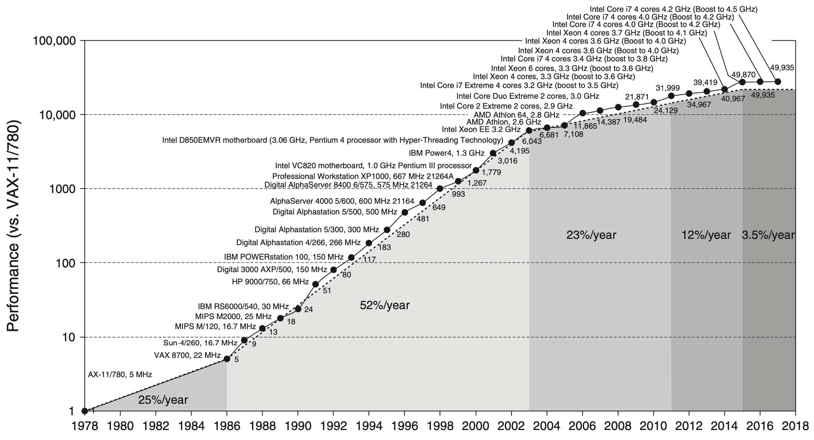
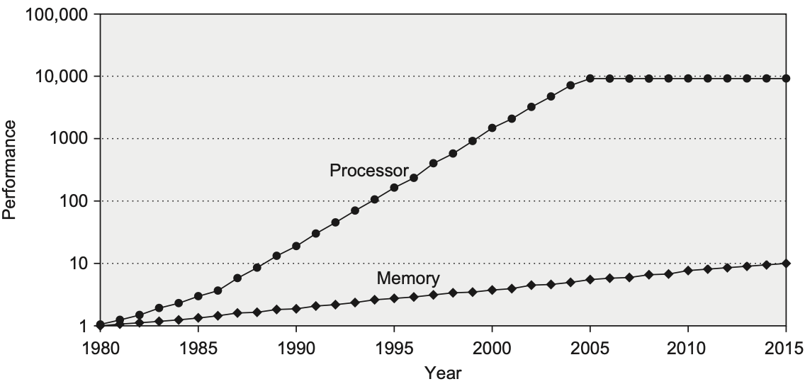

The computer architecture notes are mainly from Hennessy and Patterson's book: [Computer Architecture: A Quantitative Approach - 6th edition](https://shop.elsevier.com/books/computer-architecture/hennessy/978-0-12-811905-1), and some online sources. Since the purpose of these notes are for my prelim exam, they will not cover everything in the book - only those which I think might be useful will be included.

<!-- TOC -->

- [Overview](#overview)
    - [§1.1 Processor Performance Trend](#%C2%A711-processor-performance-trend)
        - [Dennard's Scaling](#dennards-scaling)
        - [Amdahl's Law](#amdahls-law)
        - [Moore's Law](#moores-law)
    - [§1.2 Class of Parallelism and Parallel Architectures](#%C2%A712-class-of-parallelism-and-parallel-architectures)
- [Memory Hierarchy Design](#memory-hierarchy-design)
    - [§2.1 Basics](#%C2%A721-basics)
    - [§2.2 Memory technology and optimizations](#%C2%A722-memory-technology-and-optimizations)
        - [SRAM technology](#sram-technology)
        - [DRAM technology ⚠️](#dram-technology-)
            - [SDRAM](#sdram)
            - [HBM](#hbm)
    - [Flash memory](#flash-memory)
- [Pipelining: Basic and Intermediate Concepts](#pipelining-basic-and-intermediate-concepts)
    - [§3.1 Introduction](#%C2%A731-introduction)
- [Instruction Level Parallelism](#instruction-level-parallelism)

<!-- /TOC -->

---

# Overview
## §1.1 Processor Performance Trend
The growth in processor performance over 40 years: 

- Prior to mid-1980s growth in processor performance was largely **technology-driven** and averaged about 22% per year.
- After 1986, the increase in growth to about 52% is attributable to **more advanced architecture and organizational ideas typified in RISC architectures**.
- In 2003, **the limits of power due to [Dennard's Scaling](#dennards-scaling) and the available instruction-level parallelism** slowed uniprocessor performance to 23% per year.
- From 2011 to 2015, annual improvement was less than 12%, due to **limits of parallelism of [Amdahl's Law](#amdahls-law)**.
- Since 2015, with **the end of [Moore's Law](#moores-law)**, improvement has been just 3.5% per year.

### Dennard's Scaling
In 1974 Robert Dennard observed that power density was constant for a given area of silicon even as you increased the number of transistors because of smaller dimensions of each transsitor.

Remarkably, transistors could go faster but use less power.

Dennard's Scaling ended around 2004 because current and voltage couldn't keep dropping and still maintain the dependability of integrated circuits. This change forced the microprocessor industry to use **multiple efficient processors** instead of a single inefficient processor. 

Switch from relying solely on instrcution-level parallism (ILP) to data-level parallelism (DLP) and thread-level parallelism (TLP).

### Amdahl's Law
The performance gain that can be obtained by improving some portion of a computer can be calculated using Amdahl's Law. It states that **the performance improvement to be gained from using some faster mode of execution is limited by the fraction of the time the faster mode can be used**.

Amdahl's Law prescribes practical limits to the number of useful cores per chip. If 10% of the task is serial, then the maximum performance benefit from parallelism is 10 no matter how many cores you put on the chip.

### Moore's Law
In 1965 Gordon Moore famously predicted that the number of transistors per chip would double every year, which was amended in 1975 to every two years. That prediction lasted for about 50 years, but no longer holds.

 

The combination of:
- transistors no longer getting much better beacuse of slowing of Moore's Law and the end of Dennard's scaling,
- the unchanging power budgets for microprocessors,
- the replacement of the single power-hungry processor with several energy-efficient processors, and
- the limits to multiprocessoing to achieve Amdahl's Law.

caused improvements in processor performane to slow down.

## §1.2 Class of Parallelism and Parallel Architectures
Parallelism at multiple levels is now the driving force of computer design across all four classes of computers, with **energy** and **cost** being the primary constraints. There are basically two kinds of parallelism in applications:
1. *Data-level parallelism* (DLP) arises because there are many data items that can be operated on at the same time.
2. *Task-level parallelism* (TLP) arises because tasks of work are created that can operate independently and largely in parallel.

Computer hardware in turn can exploit these two kinds of application parallelism in four major ways:

1. 

---

# Memory Hierarchy Design
The goal is to provide a memory system with a cost per byte that is almost as low as the cheapest level of memory and a speed almost as fast as the fastest level.

## §2.1 Basics
**Locality**:
  - **Spatial locality**: If a particular storage location is referenced at a particular time, then it is likely that nearby memory locations will be referenced in the near future.
  - **Temporal locality**: If at one point a particular memory location is referenced, then it is likely that the same location will be referenced again in the near future.

The importance of the memory hierarchy has increased with advances in performance of processors. The below figure plots single processor performance projections against the historical performance improvement in time to access main memory. The processor line shows the increase in memory requests per second on average. The memory line shows the incease in memory requests per second on the DRAM.

**Concerns**:
- Memory access time 
    - = Hit time + (Miss rate) x Miss penalty
- Power consumption 
    - a major consideration more recently
    - caches consumes significant power both as leakage (static) and active (dynamic) power 
    - in PMDs (personal mobile devices) the caches can account for 25% ~ 50% total power consumption
    - trade-off: performance and power consumption

**Cache placement scheme**: (To be added more contents later)
- n-way set associative: n blocks in a set
- Direct mapp: just one block per set
- Fully associative: just one set

**Three categories of cache miss**:
1. **Compulsory** - the very first access to a block cannot be in the cache.
2. **Capacity** - if the cache cannot contain all the blocks needed during execution of a program, capacity misses (in addition to compulsory misses) will occur because of blocks being discarded and later retrieved.
3. **Conflict** - if the block placement strategy is not fully associative, conflict misses (in addition to compulsory and capacity misses) will occur because a block may be discarded and later retrieved if multiple blocks map to its set and accesses to the different blocks are intermingled.

**To reduce memory access time**:
- Larger block size to reduce miss rate
  - reduce compulsory misses, slightly reduces static power (lower the numebr of tags)
  - increase miss penalty, increase capacity or conflict misses, especially in smaller caches
- Bigger caches to reduce miss rate
  - longer hit time
  - higher cost and power (both static and dynamic)
- Higher associativity to reduce miss rate
  - increase hit time
  - increase power consumption
- Multilevel caches to reduce miss penalty
  - more power-efficient than single aggregate cache

## §2.2 Memory technology and optimizations
Memory latency is quoted using two measures:
- Access time: the time between when a read is requested and when the desired word arrives.
- Cycle time: the minimum time between unrelated requests to memory.

### SRAM technology
- No need to refresh
  - access time close to cycle time
- 6 transistors per bit
- needs only minimum power to retain the charge in standby mode (static power).

### DRAM technology ⚠️
- Data needs to be written back after being read (refresh)
- single transistor per bit
- need to pre-charge row buffer
- need to refresh periodically (DRAM controller takes charge of this)

Morden DRAMs are organized in banks. Each banks consists of rows. Sending an ***ACT*** (Active) command opens a banck and a row, and loeads the row into a row buffer. When the row is in the buffer, it can be transferred by successive column address at whatever the width of the DRAM is (typically 4, 8 or 16 bits in DDR4) or by specifying a block transfer and the starting address. 

The ***PRE*** (Precharge) command closes the bank and row and readies it for a new access. Each command, as well as block transfers, are synchronized with a clock.

***RAS***: Row access strobe (To be added more contents later)

***CAS***: Column access strobe (To be added more contents later)

#### SDRAM
- No ovrehead to synchronize with controller.
- Support *burst mode*, where multiple transfers can occur without specifying a new column address. 

Improves memory performance inside a DRAM chip

With an asynchornous DRAM, every column access and transfer involved overhead to synchronize with the controller. Adding a clock signal to the DRAM interface so that the repeated transfers would not bear the overhead, thereby creating the *synchronized* DRAM.  

Typically, eight or more 16-bit transfers can occur without sending any new address by placing the DRAM in *burst mode*. The inclusion of such burst mode transfers has meant that there is a significant gap between the bandwidth for a stream of random acceses versus access to a block of data.

Access to different banks can overlap each other, which can hide the precharge time. Dividing DRAMs into banks also reduces the power consumption since only the row in a single bank is read.

The power consumption of the DRAM depends on the operating voltage.

**DDR**: Double data rate, allows a DRAM to transfer on both rising and falling edge of the clock.

**DIMM**: Dual inline memory modules. DRAMs are commonly on small board called DIMMs that contain 4~16 DRAM chips and that are normally organized to be 8 byte wide (+ECC) for desktop and server. 

**Memory management unit (MMU)**: (To be added more contents later)

#### HBM
- A packaging innovation.
- Places multiple DRAMs in a stacked or adjacent fashion embedded within the same package as the processor (also called embedded DRAM).
- Lowers the access latency
- Potentially increases the bandwidth by allowing more and faster connections between the processor and DRAM (thus called *high bandwidth memory*).

## Flash memory
- A type of EEPROM (electronically erasable programmable ROM). Normally read-only but can be erased.
- Holds contents without power.
- NAND Flash has higher density than NOR Flash and is more suitable for large-scale nonvolatile memories. 

Compared to DRAM:
- Reads to Flash are sequential and read an entire page. Has a much longer delay to access the first byte from a random address than SDRAM (150 times slower than DDR).
- Flash memory must be erased before it is overwritten, and it is erased in blocks rather than individual byte or words. For writing data, Flash is about 1500 times slower than DRAM.
- Nonvolatile.
- Flash memory limits the number of times that any given block can be written, typically at least 100000
- High density NAND Flash is cheaper than SDRAM.

# Pipelining: Basic and Intermediate Concepts
## §3.1 Introduction
What is pipelining?

\- *Pipelining* is an implementation technique whereby multiple instructions are overlapped in execution.

# Instruction Level Parallelism
