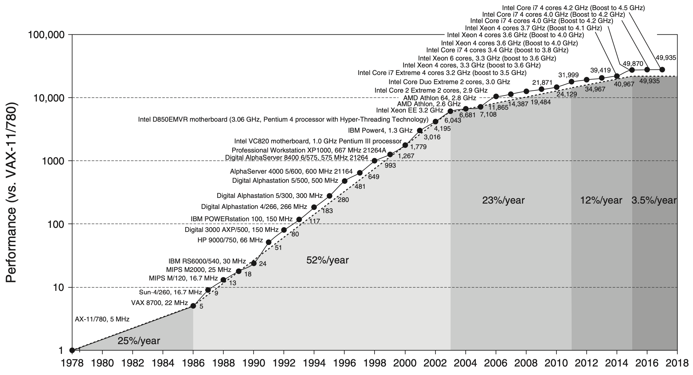

The computer architecture notes are mainly from Hennessy and Patterson's book: [Computer Architecture: A Quantitative Approach - 6th edition](https://shop.elsevier.com/books/computer-architecture/hennessy/978-0-12-811905-1), and some online sources. Since the purpose of these notes are for my prelim exam, they will not cover everything in the book - only which I think might be useful will be included.

# Computer Architecture 
Source: [Computer Architecture: A Quantitative Approach - 6th edition](https://shop.elsevier.com/books/computer-architecture/hennessy/978-0-12-811905-1)

## Overview
The growth in processor performance over 40 years: 

- Prior to mid-1980s growth in processor performance was largely **technology-driven** and averaged about 22% per year.
- After 1986, the increase in growth to about 52% is attributable to **more advanced architecture and organizational ideas typified in RISC architectures**.
- In 2003, **the limits of power due to [Dennard's Scaling](https://ycnzh.github.io/Computer_Arch#Dennard'sScaling) and the available instruction-level parallelism** slowed uniprocessor performance to 23% per year.
- From 2011 to 2015, annual improvement was less than 12%, due to **limits of parallelism of Amdahl's Law**.
- Since 2015, with **the end of Moore's Law**, improvement has been just 3.5% per year.

### Dennard's Scaling
In 1974 Robert Dennard observed that power density was constant for a given area of silicon even as you increased the number of transistors because of smaller dimensions of each transsitor.

Remarkably, transistors could go faster but use less power.

Dennard's Scaling ended around 2004 because current and voltage couldn't keep dropping and still maintain the dependability of integrated circuits. This change forced the microprocessor industry to use **multiple efficient processors** instead of a single inefficient processor. 

Switch from relying solely on instrcution-level parallism (ILP) to data-level parallelism (DLP) and thread-level parallelism (TLP).

### Amdahl's Law
The performance gain that can be obtained by improving some portion of a computer can be calculated using Amdahl's Law. It states that **the performance improvement to be gained from using some faster mode of execution is limited by the fraction of the time the faster mode can be used**.

Amdahl's Law prescribes practical limits to the number of useful cores per chip. If 10% of the task is serial, then the maximum performance benefit from parallelism is 10 no matter how many cores you put on the chip.

### Moore's Law
In 1965 Gordon Moore famously predicted that the number of transistors per chip would double every year, which was amended in 1975 to every two years. That prediction lasted for about 50 years, but no longer holds.

## Memory